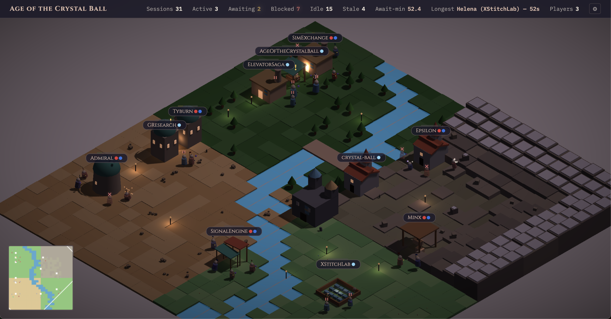

# Age of the Crystal Ball

**A real-time strategic operations dashboard for AI-assisted software engineering, disguised as a medieval RTS.**



Every Claude Code session on your machine is a unit in your army. They gather into platoons around shared projects, march between buildings named after real office locations, and glow, pulse, and animate based on what they're actually doing. One glance at the isometric battlefield tells you everything: which projects are under heavy development, which agents need your input, how long they've been waiting, and where your compute is burning.

Age of the Crystal Ball is a crystal ball -- you observe your fleet of AI coding agents, you don't control them. The aesthetic is **Age of Empires II** meets **Monument Valley** meets **Townscaper**: orthographic 3D, warm sandstone and sage, geometric architecture, clean shadows, procedural terrain with biomes and rivers. Day fades to night and back again. Particles drift. Water shimmers. Units bob and work and glow.

---

## Features

### Living Isometric World
- **Procedural terrain** -- 24x24 tile grid with 4 biomes (meadow, forest, desert, mountain), sinusoidal rivers with GPU-animated water, auto-placed bridges, organic biome transitions
- **8 unique building types** -- Forge, Library, Chapel, Observatory, Workshop, Market, Farm, Lumber Camp -- each with distinct geometry, assigned round-robin to project groups
- **Day/night cycle** -- 5-minute full cycle with dawn, day, dusk, and night phases; physically moving sun, dynamic bloom, and emissive glow that ramps up after dark
- **Post-processing** -- Unreal bloom, vignette shader, 2048x2048 soft shadow maps

### Intelligent Unit System
- **7 unit classes** with unique visual accessories -- Researchers carry floating books, Engineers wield hammers, Analysts bear golden shields, Principals wear purple capes, Interns carry lanterns, Security units fade to ghostly transparency, and Baristas get one of 5 random props
- **6 activity animations** -- each with energetic and passive variants tied to session state (coding, researching, planning, testing, reviewing, idle)
- **State-driven visuals** -- active units glow, awaiting units pulse gold with floating "!" markers, blocked units dim with "pause" icons, stale units slump and glow red
- **Memory scaling** -- units physically grow with RSS consumption
- **March-in/gravestone lifecycle** -- new sessions march from the map edge; dead sessions leave behind gravestones that fade over 60 seconds
- **Persistent medieval names** -- 46-name pool, deterministic from PID (Aldric, Bronwyn, Cedric, Freya...)

### Two Context Modes
- **Mode 1 (Passive)** -- OS-level inference from CPU, TTY, and process state. Works with zero configuration.
- **Mode 2 (Active Context)** -- A PostToolUse hook writes sidecar JSON files with task, phase, blocked state, and detail. The server merges sidecar context with OS signals for rich per-session intelligence: what Claude is working on, what phase it's in, and whether it's blocked.

### Full Interaction
- Click, shift-click, box-select, and double-click to select units and buildings
- Keyboard hotkeys: **Space** (jump to longest-waiting unit), **A** (select all awaiting), **1-5** (jump to platoon), **Q/E** (rotate camera), **Tab** (Trading Floor panel), **H** (heatmap), **M** (minimap)
- Scroll zoom from tactical to strategic view, drag panning, smooth camera rotation
- Hover tooltips with name, class, rank, state, CPU, memory, uptime

### Observability Panels
- **HUD** -- live session counts by state, total CPU/memory, cumulative agent-minutes wasted, longest-waiting unit
- **Trading Floor (War Room)** -- portfolio overview, platoon leaderboard, live activity feed, Mode 2 intel with phase distribution
- **Selection Panel** -- detailed unit/group/multi-selection views with CPU bars, state badges, and Mode 2 context
- **Minimap** -- 150x150 canvas with biome-accurate terrain, building markers, unit dots, and click-to-teleport
- **Heatmap** -- terrain tiles recolor by CPU activity (cold blue to hot red)

### Multi-Person Mode
- **Relay server** for sharing sessions across machines in real-time
- Automatic distinct player color palette when 2+ users are connected
- Player roster, banners, and namespaced session IDs
- Bearer token auth, configurable sharing settings persisted locally
- One-command demo mode with simulated multi-user setup

---

## Quick Start

```bash
cd crystal-ball

# Install dependencies
npm install

# Run with simulated data (12 fake sessions, no real processes needed)
npm run simulate

# Run with real macOS/Linux process discovery
npm start

# Open in browser
open http://localhost:3000
```

### Multi-Person Demo

```bash
# One command launches relay + two simulated users
npm run demo
```

### Hook Installation (Mode 2)

To get rich per-session context (task, phase, blocked state), install the PostToolUse hook in your Claude Code sessions. See [`hooks/crystal-ball-skill.md`](crystal-ball/hooks/crystal-ball-skill.md) for the full protocol and installation guide.

---

## Architecture

```
crystal-ball/                    Main application
  server/
    index.js                     Express server, polling loop, REST API
    classifier.js                Rolling CPU history, state heuristics
    sessionStore.js              In-memory store, grouping, idle economics
    discovery/                   Platform-specific process discovery
      simulator.js               12 fake sessions with Mode 2 phase cycling
      macos.js                   Real process discovery (ps + lsof)
      linux.js                   Linux /proc-based discovery
      sidecar.js                 Central sidecar directory reader
  public/js/                     34 ES modules (Three.js r160 via CDN)
  tests/                         480+ tests

crystal-ball-relay/              Multi-person relay server
  server/                        Express relay, in-memory store, merger
  tests/                         Relay-specific tests
```

**API**: Single endpoint `GET /api/sessions` returns `{ timestamp, sessions[], groups[], metrics }`.

**Stack**: Node.js, Express, Three.js r160 (CDN importmap), CSS2DRenderer. No bundler, no framework -- pure ES modules.

---

## License

MIT
